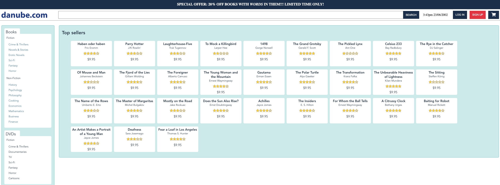
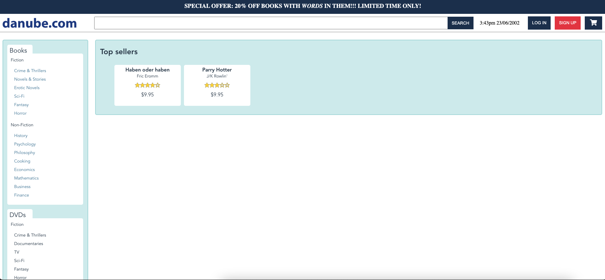
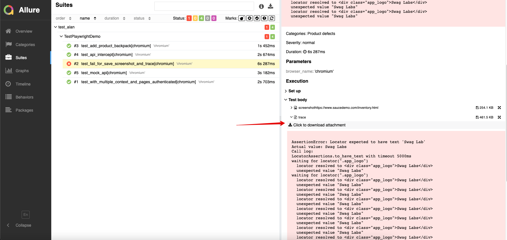

# Playwright Python demo tests

In this project I demonstrate some features of Playwright framework with Python and Pytest,for automation E2E tests.

The tests code is simple,for that reason I don't use PageObject, abstraction and others design patterns, the objective this project is show a configuration of Playwright and some of its features.

This project includes:

- Frameworks:
    - Pytest
    - Allure
    - Playwright


- Features:
    - Tests in multiple browser and pages
    - Authenticated test sessions with signed states
    - Intercepting page requests (Network Events)
    - Mock page requests
    - Screenshot on fail and attach to report
    - Generate trace file on fail and attach to report
    - Using trace file for debug failed test
    - Debug tests with interactive Playwright Inspector
    - Configuration and use of Pytest fixtures 
    - Report with Allure
    
## Demo Pages
For these tests I use a Sauce Labs demo app which can be found here: [Sauce Demo](https://www.saucedemo.com/)
And a demo shop site named as the Danube, with can be found here: [Danube Shop](https://danube-web.shop/)

## Requirements
- Python >= 3.9 - [How install Python](https://www.python.org/downloads/)
- Pip >= 21.3.x - [How install pip](https://pip.pypa.io/en/stable/installing/)
- Allure Client >= 2.21 [How install allure client](https://docs.qameta.io/allure/#_commandline)

## Getting Started
Create a virtual environment:

```bash
$ python -m venv venv
$ source venv/bin/activate
```

Install dependencies:

```bash
$ pip3 install --no-cache-dir -r requirements.txt
```

## Configure Playwright:
```bash
$ playwright install
```

## To run tests in Chrome (for headless mode remove --headed parameter)
```bash
$ pytest -vv --headed --browser chromium --alluredir=results/allure_report
```

## To run tests in firefox Browser (for headless mode remove --headed parameter):
```bash
$ pytest -vv --headed --browser firefox --alluredir=results/allure_report
```

## To run tests with slo-mo mode
```bash
$ pytest -vv --headed --browser chrome --slowmo 500 --alluredir=results/allure_report
```


## Tests with multiple browser instances (contexts) and multiple pages
With playwright all tests is isolated with contexts and pages, in this project all the browser contexts are defined as 
fixtures, in file conftest.py is possible change and create new contexts. 

>IMPORTANT any context created must have the 
word "context_" at the beginning of the name, if the context is created without this section then the screenshot or 
trace files will not be automatically saved in case of failure.

> Inside conftest.py there is a login function that will authenticate using the users from the 
> fixtures/users.json file, for each user teh function save the authenticated state

> If login fails, the test suite is aborted

Example of context as fixture using saved authenticated state for user Standard:

```python
# conftest.py
from playwright.sync_api import Browser
import pytest

DEFAULT_TIMEOUT = 5000

@pytest.fixture(scope="function")
def context_standard_user(browser: Browser, **browser_context_args):
    context = browser.new_context(storage_state="standard_user_state.json")
    context.tracing.start(screenshots=True, snapshots=True, sources=True)
    context.set_default_timeout(DEFAULT_TIMEOUT)
    yield context
    context.close()
```

Example of test with multiple contexts and pages:
```python
#test_playwright_demo.py

from playwright.sync_api import expect

def test_with_multiple_context_and_pages_authenticated(self, context_problem_user, context_standard_user):
      self.page_one = context_standard_user.new_page()
      self.page_one.goto("https://www.saucedemo.com/inventory.html")
      self.logo_one = self.page_one.locator(".app_logo")
      self.page_two = context_problem_user.new_page()
      self.page_two.goto("https://www.saucedemo.com/inventory.html")
      self.logo_two = self.page_two.locator(".app_logo")
      expect(self.logo_one).to_have_text("Swag Labs")
      expect(self.logo_two).to_have_text("Swag Labs")
```


## Intercepting page requests (Network Events)
Playwright provides APIs to monitor and modify network traffic, both HTTP and HTTPS. Any requests that a page does, 
including XHRs and fetch requests, can be tracked, modified and handled.

In the example below I demonstrate a test that intercepts the http request from the api, collects the titles of the 
books and verifies if there is any book with the title Haben oder haben

```Python
# test_playwright_demo.py

import json
from operator import itemgetter

def test_api_intercept(self, context_clean):
    self.page = context_clean.new_page()
    with self.page.expect_response("**/api/books") as response_info:
        self.page.goto("https://danube-web.shop/")
        self.response_body = json.loads(response_info.value.body())
        self.titles = list(map(itemgetter('title'), self.response_body))
        assert 'Haben oder haben' in self.titles
```
## Mock page requests
With playwright, it is possible to mock requests (network events), thus modifying the behavior and content of a 
page in real time


In this example, the books endpoint of the api is mocked, where only two items are informed, 
the quantity and titles are validated

```Python
# test_playwright_demo.py

import json

def test_mock_api(self, context_clean):
  
    # New API response
    request_body = [
        {
            "id": 1,
            "title": "Haben oder haben",
            "author": "Fric Eromm",
            "genre": "philosophy",
            "price": "9.95",
            "rating": "★★★★☆",
            "stock": "1"
        }, ...
    ]
    
    self.page = context_clean.new_page()
    # Intercept and change Api response with new body
    self.page.route(
        "**/api/books",
        lambda route: route.fulfill(
            content_type='application/json',
            status=200,
            body=json.dumps(request_body)
        )
    )
    # Wait for page load
    self.page.wait_for_load_state('networkidle')
    self.page.goto("https://danube-web.shop/")
    self.products_container = self.page.query_selector(".shop-content")
    self.products_name = self.products_container.text_content()
    self.number_of_products = len(self.products_container.query_selector_all('li'))
    assert "Haben oder haben" and "Parry Hotter" in self.products_name
    assert self.number_of_products == 2
```
- Before api mock:




- After api mock:



## Interactive Debug
Set the PWDEBUG environment variable to run your Playwright tests in debug mode or just add page.pause() on code.
This configures Playwright for debugging and opens the inspector.
When add the command page.pause() in the code snippets, when the test 
reach page.pause() debug test is paused.

For debug a specific test scenario:
```bash
$ PWDEBUG=1 pytest --browser chromium test_playwright_demo.py::TestPlaywrightDemo::test_add_product_backpack
```

```Python
# test_playwright_demo.py

import json
from operator import itemgetter

def test_api_intercept(self, context_clean):
    self.page = context_clean.new_page()
    with self.page.expect_response("**/api/books") as response_info:
        self.page.goto("https://danube-web.shop/")
        self.response_body = json.loads(response_info.value.body())
        self.titles = list(map(itemgetter('title'), self.response_body))
        assert 'Haben oder haben' in self.titles
```


## Trace viewer
If any test fail, the trace file is attach in the report, for see and debug with the trace execute the command:

```bash
$ playwright show-trace FILE-NAME.ZIP
```


Get the trace file from failed test:



## Automatic save screenshot and trace file if test fail

In the conftest.py file there is the function pytest_runtest_makereport, every time a test is executed this function 
is called, and if the test fails it will interact in all browsers and pages, will take the screenshot, save the trace file and attach it in the execution report
>Important, every new context must be created as a fixture with the name context_, if the context is created in another 
> way, then the screenshot and the trace file will not be saved.

> Trace file is saved on traces folder
```python
# conftest.py

import pytest
from slugify import slugify
from pathlib import Path

@pytest.hookimpl(tryfirst=True, hookwrapper=True)
def pytest_runtest_makereport(item, call):
    outcome = yield
    rep = outcome.get_result()
    if rep.failed and rep.when != 'setup':
        traces_dir = Path("traces")
        trace_file = str(traces_dir / f"{slugify(item.nodeid)}.zip")
        partial_context_name = 'context_'
        # Iterate on items to get the actual context
        context = next(
            (value for key, value in item.funcargs.items()
             if key.lower().startswith(partial_context_name)),
            None
        )
        if context:
            # Generate page trace, take screenshot and attach to report
            context.tracing.stop(path=trace_file)
            try:
                # Get each page and take a screenshot
                for page in context.pages:
                    allure.attach(
                        page.screenshot(),
                        name='screenshot' + f'{page.url}',
                        attachment_type=allure.attachment_type.PNG
                    )
                allure.attach.file(
                    trace_file,
                    name='trace',
                    extension="zip"
                )
            except Exception as e:
                print('Fail to take screen-shot: {}'.format(e))
        else:
            pass
```

## Reports
> You must have the allure client installed

Run the command below to generate the test report:

```bash
$ allure generate --clean results/allure_report -o results/allure_result 
```

To view the report in the browser:

```bash
$ allure open results/allure_result
```
